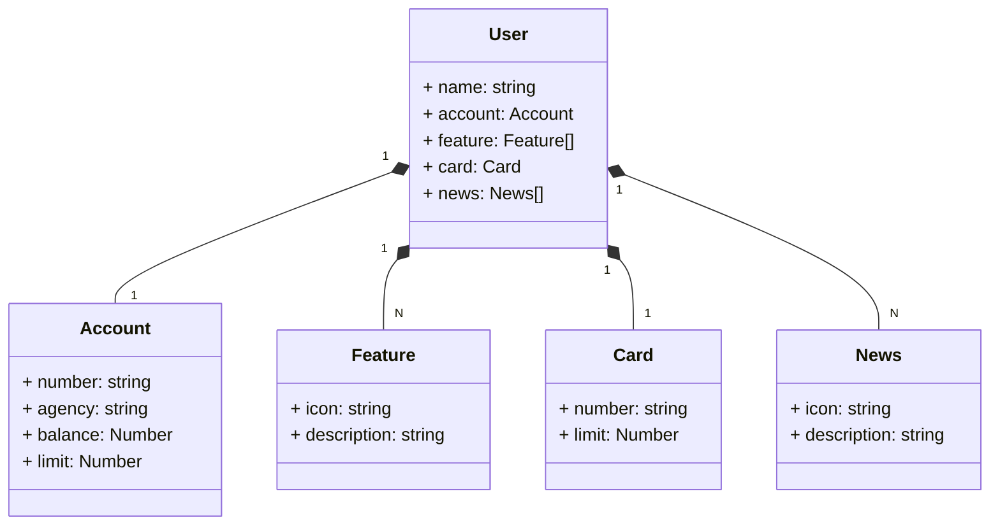

# Santander Dev Week 2023
Criação Java RESTful

## Diagrama de Classes

```mermaid
classDiagram
  class User {
    + name: string
    + account: Account
    + feature: Feature[]
    + card: Card
    + news: News[]
  }

  class Account {
    + number: string
    + agency: string
    + balance: Number
    + limit: Number
  }

  class Feature {
    + icon: string
    + description: string
  }

  class Card {
    + number: string
    + limit: Number
  }

  class News {
    + icon: string
    + description: string
  }
  User "1" *-- "1" Account
  User "1"*-- "N" Feature
  User "1"*-- "1"Card
  User "1"*-- "N" News
```
